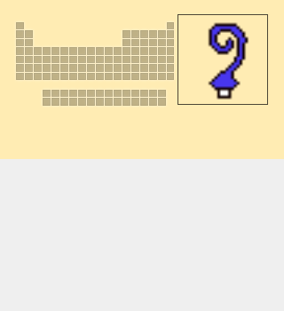
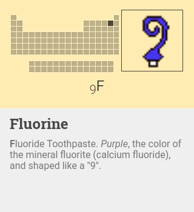

# Periodic Table Memory Pegs

**Chemical elements flashcard deck for [Anki](https://apps.ankiweb.net/)**,
featuring all 118 of the periodic table,
to help you memorize and associate name, atomic number, position in the table,
and symbol of elements.

### How it works

Each element is associated with a picture,
which is designed to remind you
of the element's name, atomic number, and abbreviation.

The cards in the deck will question you with one of the following:
Picture, Name, Symbol, Number, or Position.
The other side of the card will display all remaining data.
There is also an explanation of how to use the pictures as memory pegs.

**An example with fluorine:**

<table>
    <tr>
        <th scope="col">Front</th>
        <th scope="col">Back</th>
    </tr>
    <tr>
        <td></td>
        <td></td>
    </tr>
</table>

### Getting started

The latest release is available on AnkiWeb
[shared deck page](https://ankiweb.net/shared/info/490209917).

If you want to use the work-in-progress version to the next release,
you can download this git repository, checkout the `develop` branch,
and execute the `main.py` script to build the deck
(`packages/periodic-table-memory-pegs.apkg`),
import it in Anki and you're ready to go!

### Contribute!

Please feel free to contribute to this repo,
here is what I would like to implement shortly:

- [x] memory pegs for the missing elements,
- [x] night mode,
- [ ] spell checking,
- [ ] redesign of the cards, to suit all devices

any other suggestions are open to discussion:
[open a new issue](https://github.com/remiberthoz/anki-periodic-table-memory-pegs/issues)
to let me know!

### Background

#### Legacy deck

Before existing on GitHub,
this deck was created and shared on the AnkiWeb platform.
Since the latter lacks contribution features, it has been suggested to me
that I could release it here as a git repository.
From now on my plan is to review comments and suggestions with care,
and accept motivated pull requests.

#### Original source

This memory peg system was initiated by John P. Pratt.
You can find a nice periodic table constructed with the memory pegs on the
[website](http://www.johnpratt.com/atomic/periodic.html).
With their permission, I turned their work into a Anki deck.
